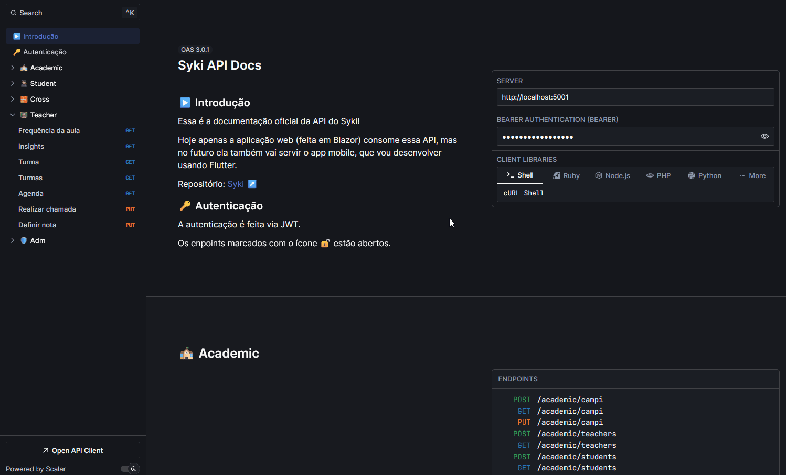
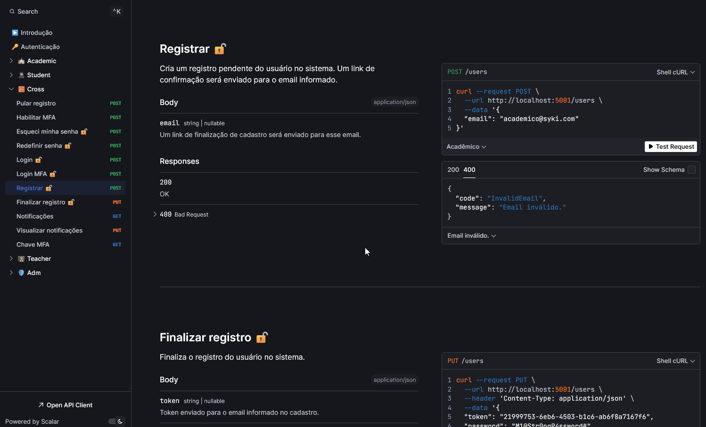
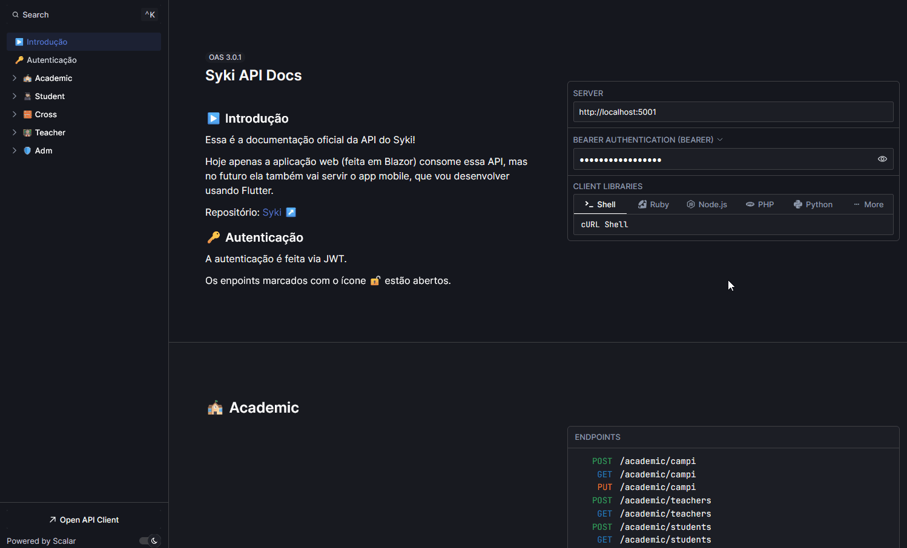

# 📝 Documentação de APIs com Scalar!

O [Scalar](https://github.com/scalar/scalar) é uma excelente alternativa ao Swagger para documentar suas APIs. Ele utiliza o padrão OpenAPI para apresentar todas as especificações dela de maneira elegante e intuitiva.

Dá pra agrupar e descrever como cada endpoint funciona, adicionando exemplos de requests/responses/erros. Ele também oferece suporte a diferentes client libraries e métodos de autenticação.

Os exemplos a seguir foram retirados da documentação do [Syki](https://github.com/ZaqueuCavalcante/syki), um projeto open source que estou desenvolvendo, voltado para o gerenciamento acadêmico de faculdades. Até o momento ele possui cerca de 70 endpoints, que podem ser acessados [aqui](https://api.syki.com.br/docs/v1).

## 0️⃣ Interface moderna

  

## 1️⃣ Fácil navegação e busca por termos

  

## 2️⃣ Realização de requests (estilo Insomnia/Postman)

  

## 3️⃣ Suporte a múltiplos exemplos de requests/responses/erros

  

## 4️⃣ Múltiplos métodos de autenticação (JWT, ApiKey, OAuth2...) e client libraries (C#, Node, Python...)

  

