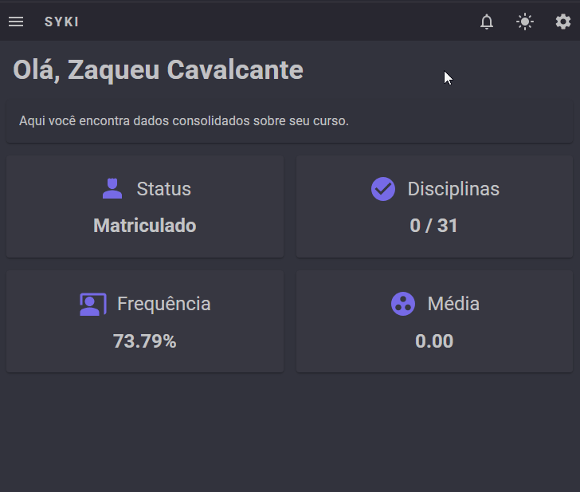

# 🌐 Azure Blob Storage

Adicionei integração com o 𝐀𝐳𝐮𝐫𝐞 𝐁𝐥𝐨𝐛 𝐒𝐭𝐨𝐫𝐚𝐠𝐞 no projeto open-source que estou desenvolvendo!

O 𝐒𝐲𝐤𝐢 (https://github.com/ZaqueuCavalcante/syki) é um sistema de gerenciamento de instituições de ensino que pode ser usado por gestores, professores e alunos.

Aplicações desse tipo precisam lidar com 𝐚𝐫𝐪𝐮𝐢𝐯𝐨𝐬 frequentemente:

• Professores subindo slides de aulas, apresentações e documentos
• Alunos baixando declarações de matrícula e enviando PDFs como anexos em atividades
• Gestores produzindo relatórios e requerimentos acadêmicos

Pensando nisso, implementei uma integração com o Azure Blob Storage para que esses arquivos sejam salvos na nuvem.

Para validar que tudo estava funcionando, utilizei um caso de uso mais simples: permitir que um usuário possa definir sua foto de perfil.

Inicialmente criei uma 𝐒𝐭𝐨𝐫𝐚𝐠𝐞 𝐀𝐜𝐜𝐨𝐮𝐧𝐭 na Azure, defini um 𝐂𝐨𝐧𝐭𝐚𝐢𝐧𝐞𝐫 chamado "profile-photos" para armazenar as fotos e configurei o 𝐂𝐎𝐑𝐒.

No backend tenho um endpoint que é responsável por gerar 𝐒𝐡𝐚𝐫𝐞𝐝 𝐀𝐜𝐜𝐞𝐬𝐬 𝐒𝐢𝐠𝐧𝐚𝐭𝐮𝐫𝐞𝐬 (𝐒𝐀𝐒) 𝐔𝐑𝐈𝐬 na Azure.

Essas URIs permitem que o frontend consiga realizar o upload da foto de perfil do usuário diretamente do navegador para o 𝐁𝐥𝐨𝐛 𝐒𝐭𝐨𝐫𝐚𝐠𝐞, de maneira segura e eficiente.

Segue um GIF de como ficou a experiência final:

  

#azure #blob #storage #api #aspnet #postgres #opensource
