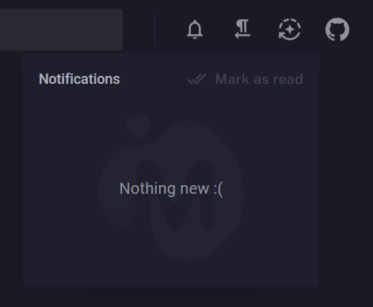

00 - [ ] Run API tests on pipeline
01 - [X] Add authentication and authorization
02 - [X] Use Identity? YES
03 - [X] Manage API access
04 - [ ] Add some use cases
05 - [x] Fix front deploy
06 - [ ] Add policies instead roles
07 - [ ] Link Aluno and Professor to SykiUser
08 - [ ] Add full intial setup usecase (Academico -> Professor + Aluno views)
09 - [ ] Add full setup and login flows for Two Factor Auth (+ QrCode)
10 - [ ] Add calendar?
11 - [ ] Use Result Pattern instead throw exceptions
12 - [ ] https://devblogs.microsoft.com/dotnet/whats-new-with-identity-in-dotnet-8/

https://stenbrinke.nl/blog/taking-ef-core-data-seeding-to-the-next-level-with-bogus/

https://portalservicos.usp.br/
https://siga.ufpr.br/portal/sobre/
https://siga.ufpe.br/ufpe/jsp/FolderModulosSiga.jsf

## Notifications Feature

- Eu como Academico devo poder enviar uma notificacao para TODOS os Alunos
    - Exemplo: avisar sobre o inicio do periodo, feriadao, semana de provas...

- Cada Notificacao possui:
    - Id
    - Title
    - Description
    - CreatedAt

- Cada Notificacao pode ser enviada para n Alunos
- Cada Aluno pode visualizar a Notificacao ou nao:
    - AlunosNotificacoes:
        - AlunoId
        - NotificacaoId
        - Vista (bool)

- Como Academico, preciso poder:
    - Cadastrar uma Notificacao (e editar?)
    - Definir para quais usuarios ela vai aparecer:
        - Grupos de usuarios
        - Usuario especifico
    - Visualizar pra quantos usuarios a notificacao foi enviada e quantos visualizaram ela
    - Assim que eu cadastrar uma nova Notificacao, todos os usuarios vinculados devem:
        - Se logados, ver um indicativo na tela (quantidade de notificacoes n lidas)
            - Deve ser atualizado via SignalR
        - Ao entrar no sistema ou reload, ver o mesmo indicativo
    - Ao clicar no icone com as notificacoes, todas devem ser marcadas como lidas (??)
        - Ter um check informando q leu??
        - Abrir cada uma em dialog pra poder ler tudo e ai sim marcar como lida??

- Conceito de notificacao padrao:
    - A cada usuario criado, vincular uma notificacao de boas vindas
    - Perceba q a notificacao n muda, apenas um novo vinculo eh feito

## MUDBLAZOR SITE EXAMPLE:

